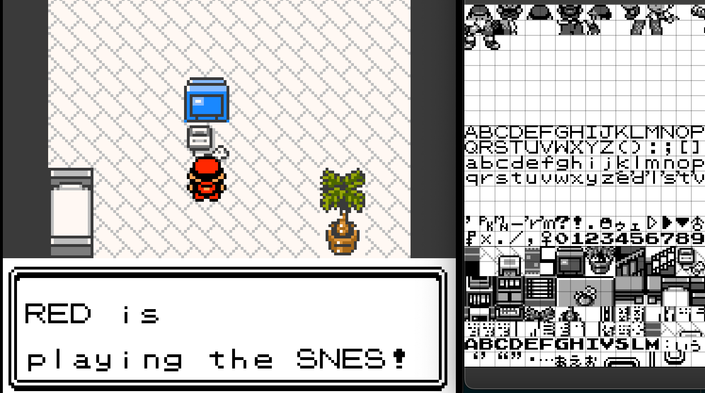
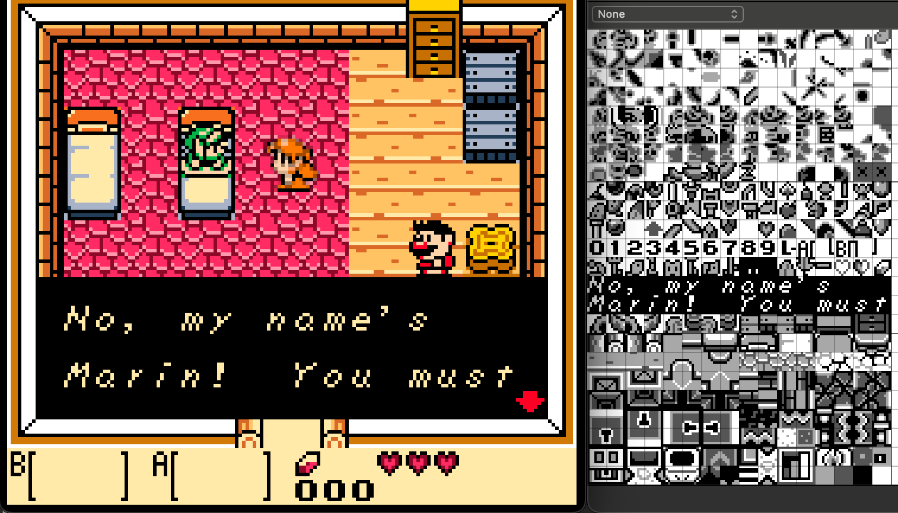
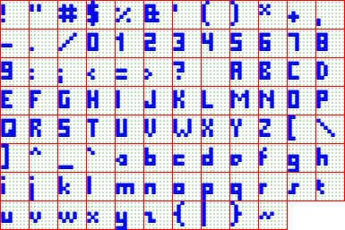
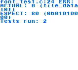
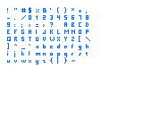
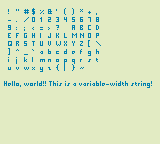

## Variable Width Font Rendering

To render a scene on a gameboy or gameboy color, one must create a tileset of tiles of 8x8 pixels, and assign these tiles to the background. The gameboy background is 32x32 tiles and the screen renders a 20x18 portion of it.

It therefore makes a lot of sense to render text using 1 tile per character, resulting in a fixed-width 8x8 font. Most popular games use this.





My goal is to find a way to render variable-width fonts, with the intention to render more than 20 characters on a single line. I do intend to stick to the 8 pixels vertically, but horizontally I want to "ignore" the 8-pixel grid and create a software text renderer for the gameboy.

## Finding a font

The first step is finding a font. I'm really lazy, so I'll grab a free pixelated font from [FontSpace.com](https://www.fontspace.com).

I like [Pixel Millennium](https://www.fontspace.com/pixel-millennium-font-f14020), because it has a variety of character widths, making it suitable for this demo. This font is free for personal use, but not for commercial use and one can [buy a commercial license here](https://futuremillennium.com/fonts/license/#pixel-millennium).

**TODO: Buy the license**

## Encoding variable-width characters in C

The next step is to convert the TTF to a map of characters I can use as a basis to render the text width. My instinct tells me to render the characters as a 1-bit bitmap, where each byte represents 8 pixels of either "background color" (0, for white) and "text color" (1, for black).

My bitmap should also contain the width and height of a character. I intend to use the same height for all characters, so I only need to store the width of a character, using a global "height" constant for the height for all characters.

I haven't actually checked, but I assume the smallest character is 1 pixel wide and the largest character is 5 pixels wide, so I need at least 3 bits to encode the width of a character. 3 bits nicely encodes 0 up to 7, which I expect to cover all characters.

Finally, I'm going to encode all characters in a single buffer of bytes named `font_data`, and because they will all have different sizes, I'm going to need some kind of index. This index will mirror an ASCII table for common characters, starting at 33 (!) and ending at 126 (~), for 94 characters total. The index will contain pointers to the start of the `font_data` for each character.

To make the pointers work, I'm going to have to align each character in the font_data with the start of a byte, so I expect there be some padding bits between them.

To summarize, I expect to encode the font as C code as follows:

```c
const uint8_t font_letter_spacing = 1;
const uint8_t font_space_width = 3;
const uint8_t font_height = 5;
const uint8_t font_data[] = { 0xFF, /* encoded pixels for all characters */ };
const uint16_t font_indices[] = {
  0, // !
  2, // "
  5, // #
  // etc
};

// example usage...
const uint8_t *character_bitmap = &font_data[font_indices['#'-33]];
```

Whether this is an optimal solution, I don't know. But I'll find out, by doing. Let's generate some font data by rendering the TTF to font data!

## Encoding the font

The easiest way to encode the characters to font data I can think of is by using Javascript. I can render each character onto a a canvas, extract the pixels and convert them to my desired `font_data` and indices.

First, I render the characters to a canvas. For some reason the font keeps rendering slightly blurry, so I'll just render the font pretty big and query the center of "assumed pixels". I rendered the "query pixels" green, the borders red and the font blue:



By rendering these characters, I immediately notice the characters not only have a variable height, they also have a variable vertical position. My plan to encode the characters with a fixed height of 5 will fail anyway since some characters are clarly taller than that, with the `$` being 7 pixels tall while the `.` (period) is 1 pixel tall. The underscore, `_` starts at the very bottom and the `'` starts at the very top. The `@` is not supported by the font, so I'm going to keep that character blank for now.

To support a variable width, height and vertical offset, I'm going to encode the width, height and vertical offset of each character. Analyzing all characters, I found that the width, height and vertical offsets all vary by at least 5, I'm going to need at least 3 bits for each value, 9 bits total. I might still pack them as 1 byte per value, depending on the size vs performance tradeoff, since extracting 3 bits from a byte is likely extra work.

Packing the pixel data tightly with the 9 bits of metadata, the majority of characters will fit in 3 or 2 bytes. Since most characters are 3x5 pixels, they need 15 bits. Add 9 bits of metadata, and you get a nice round 24 bits.

I suspect I'll be needing to calculate the width of a string without actually rendering it, so I want to pack the width at the beginning for easy access.

Skipping the implementation details, the result looks like this:

**font_data.h**
```c
#pragma once

#include <stdint.h>

#define font_data_ascii_offset 33
#define font_data_ascii_max 126

extern const uint8_t font_data[278];
extern const uint16_t font_data_indices[94];
```

**font_data.c**
```c
#include "font_data.h"

const uint8_t font_data[278] = {
  /* <blank> */ 0x00,
  /* ! */ 105, 46,
  /* " */ 83, 90,
  /* # */ 109, 212, 87, 95, 1,
  /* ... */
  /* | */ 57, 254,
  /* } */ 59, 34, 89, 10,
  /* ~ */ 212, 180, 0,
};

const uint16_t font_data_indices[94] = {
  /* ! */ 1,
  /* " */ 3,
  /* # */ 5,
  /* ... */
  /* | */ 269,
  /* } */ 271,
  /* ~ */ 275,
};
```

It compiles without error! Now let's see if I can render the characters on a gameboy.

## Rendering characters

Let's attempt to write the characters as tiles on a gameboy, rendering one character per tile. I'm going to create 2 new files - `font.h` and `font.c`; These will contain functions for rendering the characters. Before I deal with the gameboy's native 2-bits-per-pixel encoding, I'm going to use GBDK-2020's (GameBoy Development Kit) 1bpp to simplify the implementation, where one byte simply represents 1 row of 8 pixels, and each tile of 8x8 pixels is represented by 8 bytes.

**font.h**
```c
#pragma once

#include <gb/gb.h>
#include <stdint.h>

uint8_t font_render_character_1bpp(uint8_t *tile, int8_t dx, int8_t dy, char c);
```

With 1bpp, one can use the following GBDK functions to render the character:

```c
// Set the color for the high pixels (fgcolor) and low pixels (bgcolor)
void set_1bpp_colors(uint8_t fgcolor, uint8_t bgcolor);

// Upload `ntiles` tiles to VRAM at `start` with 8 bytes per tiles from `src`
void set_bkg_1bpp_data(uint16_t start, uint16_t ntiles, const void *src);

// Render a tile from VRAM, identified by `t`, at `x`,`y` on the background
uint8_t * set_bkg_tile_xy(uint8_t x, uint8_t y, uint8_t t);
```

Let's define `font_render_character_1bpp`, returning 0, which is the minimum definition that compiles. I am going to implement this using Test-Driven-Development:

**font.c*
```c
#include "font.h"
#include "font_data.h"

uint8_t font_render_character_1bpp(uint8_t *tile, uint8_t dx, uint8_t dy, char c) {
  (void)tile;
  (void)dx;
  (void)c;

  return 0;
}
```

**font_test.h**
```c
#pragma once

char *font_test(void);
```

**font_test.c**
```c
#include "font_test.h"
#include "minunit.h"
#include "font.h"

static uint8_t tile_data[32];

static char *test_font_render_character_1bpp_missing_character(void) {
  uint8_t size = font_render_character_1bpp(tile_data, 0, 0, ' ');
  mu_assert_eq(size, 0, "%d");
  return 0;
}

char *font_test(void) {
  mu_run_test(test_font_render_character_1bpp_missing_character);
  return 0;
}
```

This passes, as expected. Let's add a test!

```c
static char *test_font_render_character_1bpp_known_character(void) {
  uint8_t width = font_render_character_1bpp(tile_data, 0, '!');
  mu_assert_eq(width, 1, "%d");
  return 0;
}
```


As expected, this fails. In TDD spirit, let's only return the width, as that is the only thing being tested. For all other cases, it should return 0. I'm going to extend my test suite to cover all these cases, and clean up the suite a bit:

**font_test.c**
```c
#include "font_test.h"
#include "minunit.h"
#include "font.h"
#include "font_data.h"

static uint8_t tile_data[32];

static uint8_t render(char c) {
  return font_render_character_1bpp(tile_data, 0, 0, c);
}

static char *test_font_render_character_1bpp_missing_character(void) {
  mu_assert_eq(render(' '), 0, "%d"); // Test a space
  mu_assert_eq(render('@'), 0, "%d"); // Test a known missing character
  mu_assert_eq(render(200), 0, "%d"); // Test beyond 7-bit ascii range
  mu_assert_eq(render(18), 0, "%d"); // Test before visible characters
  return 0;
}

static char *test_font_render_character_1bpp_known_character(void) {
  mu_assert_eq(render('!'), 1, "%d"); // Known 1-pixel wide
  mu_assert_eq(render('#'), 5, "%d"); // Known 5-pixel wide
  return 0;
}

char *font_test(void) {
  mu_run_test(test_font_render_character_1bpp_missing_character);
  mu_run_test(test_font_render_character_1bpp_known_character);
  return 0;
}
```

**font.c**
```c
#include "font.h"
#include "font_data.h"

uint8_t font_render_character_1bpp(uint8_t *tile, uint8_t dx, uint8_t dy, char c) {
  if (c < font_data_ascii_offset
  || c > font_data_ascii_max)
    return 0;

  uint16_t i = font_data_indices[(uint8_t)c - font_data_ascii_offset];
  if (i == 0)
    return 0;

  uint8_t *char_data = &font_data[i];
  uint8_t width = char_data[0] & 0x07;

  (void)tile;
  (void)dx;
  (void)dy;

  return width;
}
```

Now to render the actual tiles. But first, a test! I don't know a pretty way to test rendered graphics, but adding this after `render('#')` this should suffice for now:

```c
static char *test_font_render_character_1bpp_known_character(void) {
  mu_assert_eq(render('!'), 1, "%d"); // Known 1-pixel wide

  memset(tile_data, 0, sizeof(tile_data));
  mu_assert_eq(render('#'), 5, "%d"); // Known 5-pixel wide
  mu_assert_eq(tile_data[0], 0b00000000, "%d");
  mu_assert_eq(tile_data[1], 0b01010000, "%d");
  mu_assert_eq(tile_data[2], 0b11111000, "%d");
  mu_assert_eq(tile_data[3], 0b01010000, "%d");
  mu_assert_eq(tile_data[4], 0b11111000, "%d");
  mu_assert_eq(tile_data[5], 0b01010000, "%d");
  mu_assert_eq(tile_data[6], 0b00000000, "%d");
  mu_assert_eq(tile_data[7], 0b00000000, "%d");

  return 0;
}
```



As expected, the test fails. Now to implement the actual rendering:

```c
uint8_t font_render_character_1bpp(uint8_t *tile, int8_t dx, int8_t dy, char c) {
  if (c < font_data_ascii_offset
  || c > font_data_ascii_max)
    return 0;

  uint16_t i = font_data_indices[(uint8_t)c - font_data_ascii_offset];
  if (i == 0)
    return 0;

  uint8_t *char_data = &font_data[i];
  uint8_t width = char_data[0] & 0x07;
  uint8_t height = (char_data[0] >> 3) & 0x07;
  dy += ((char_data[0] >> 6) & 0x03) | ((char_data[1] & 0x01) << 2);

  uint8_t bit_index = 9;

  for (uint8_t y = 0; y < height; y++) {
    int8_t py = dy + (int8_t)y;

    if (py < 0 || py >= 8)
      continue;

    for (uint8_t x = 0; x < width; x++, bit_index++) {
      int8_t px = dx + (int8_t)x;

      if (px < 0
      || px >= 8
      || !((char_data[bit_index >> 3] >> (bit_index & 7)) & 1u))
        continue;

      tile[py] |= (uint8_t)(1u << (7 - px));
    }
  }

  return width;
}
```

This implementation is obviously not efficient, but the test does pass. Now to actually put them on the screen! Exciting stuff!

**main.c** (partial)
```c
#include "font.h"
#include "font_data.h"
#include <string.h>

#define _tile_size 8
#define _char_count 94

static uint8_t tile_data[_tile_size * _char_count];

static void render_font_characters(void) {
  memset(tile_data, 0, sizeof(tile_data));

  for (uint8_t i = 0; i < _char_count; i++)
    font_render_character_1bpp(&tile_data[i * _tile_size], 0, 0,
      font_data_ascii_offset + i);
  set_bkg_1bpp_data(1, _char_count, tile_data);

  for (uint8_t y = 0; y < 8; y++)
    for (uint8_t x = 0; x < 12; x++)
      if (y * 12 + x < _char_count)
        set_bkg_tile_xy(x + 1, y + 1, 1 + y * 12 + x);
}
```



It works! With the dx & dy arguments, I can render the characters anywhere in a tile. This should make the next step easy: Variable-Width Text Rendering.

## Variable-Width Rendering

For my next function, rendering a line of text, I'm going to use a function like this:

**font.h**
```c
#define font_letter_spacing 1
#define font_space_width 2

typedef struct {
  const char *remainder;
  uint8_t pixel_count;
  uint8_t tile_count;
} font_render_line_result_t;

// Render a string into a 1bpp tile buffer.
//
// Characters from the string are rendered using font_render_character_1bpp,
// starting at dx & dy. Characters are rendered until the end of the string, the
// end of the line or the end of the available tiles.
//
// Once the end is reached, `remainder` is returned, representing a pointer to
// the next character in the string not rendered, or the end of the string.
// Additionally, the amount of tiles written to is returned as `tile_count`, and
// the amount of pixels rendered is returned as `pixel_count`.
font_render_line_result_t font_render_line_1bpp(
  uint8_t *tiles,
  uint8_t tiles_length,
  int8_t dx,
  int8_t dy,
  const char *string
);
```

Let's write some tests for this function:

**font_test.c**
```c
#define tile_data_length 4
static uint8_t tile_data[tile_data_length * 8];
static char *test_font_render_line_1bpp_simple(void) {
  memset(tile_data, 0, sizeof(tile_data));
  font_render_line_result_t result =
    font_render_line_1bpp(tile_data, tile_data_length, 0, 0, "Hi");

  // Note: I've created this font_get_line_width function as well,
  // but that's outside the scope of this blog to keep it brief.
  uint8_t expected_pixels = font_get_line_width("Hi");
  uint8_t expected_tiles = (expected_pixels + 7) / 8;

  mu_assert_eq(*result.remainder, '\0', "%c");
  mu_assert_eq(result.pixel_count, expected_pixels, "%d");
  mu_assert_eq(result.tile_count, expected_tiles, "%d");

  return 0;
}

static char *test_font_render_line_1bpp_too_long(void) {
  const char *text = "This is a long string!";
  memset(tile_data, 0, sizeof(tile_data));
  font_render_line_result_t result =
    font_render_line_1bpp(tile_data, tile_data_length, 0, 0, text);

  // because the tile_data is too short to fit the string, the remainder should
  // point to a non-NULL character
  mu_assert(*result.remainder != '\0');

  // The remainer should also be greater than the start of the text
  mu_assert(result.remainder > text);

  mu_assert_eq(result.tile_count, tile_data_length, "%d");
  mu_assert(result.pixel_count <= tile_data_length * 8);

  return 0;
}
```

Now to implement them.

**font.c**
```c
font_render_line_result_t font_render_line_1bpp(
  uint8_t *tiles,
  uint8_t tiles_length,
  int8_t dx,
  int8_t dy,
  const char *string
) {
  uint8_t x = dx;
  const char *current_char = string;

  while (*current_char) {
    char c = *current_char;

    if (c == '\n')
      break;

    if (c == ' ') {
      x += font_space_width;
      current_char++;
      continue;
    }

    uint8_t tile_x = x / 8;
    int8_t offset_x = x % 8;

    if (tile_x >= tiles_length)
      break;

    uint8_t w = font_render_character_1bpp(&tiles[tile_x * 8], offset_x, dy, c);

    if (offset_x + w > 8 && tile_x + 1 < tiles_length) {
      offset_x -= 8;
      tile_x++;
      font_render_character_1bpp(&tiles[tile_x * 8], offset_x, dy, c);
    }

    x += w + font_letter_spacing;
    current_char++;
  }

  uint8_t rendered_width = (uint8_t)(x - dx);

  font_render_line_result_t result;
  result.remainder = current_char;
  result.pixel_count = rendered_width > 0
    ? rendered_width - font_letter_spacing : 0;
  result.tile_count = (uint8_t)((x + 7) / 8);

  return result;
}
```

**main.c**
```c
static void render_line(const char *text) {
  // create and clear a buffer for 20 1bpp tiles
  uint8_t text_tile_data[_tile_size * 20];
  memset(text_tile_data, 0, sizeof(text_tile_data));

  // render the characters into 20 tiles, starting at x=4, y=0
  font_render_line_1bpp(text_tile_data, 20, 4, 0, text);

  // upload the 20 tiles to VRAM at id=100
  set_bkg_1bpp_data(100, 20, text_tile_data);

  // render the VRAM tiles id=100-120 at x=0-20, y=10 on the background
  for (uint8_t i = 0; i < 20; i++)
    set_bkg_tile_xy(i, 10, 100 + i);
}

void main(void) {
  render_line("Hello, world!! This is a variable-width string!");
}
```



It works!

There's lots of room for optimization and rendering of new-lines, but that's outside the scope of this already lengthy blog. Thanks for reading!
